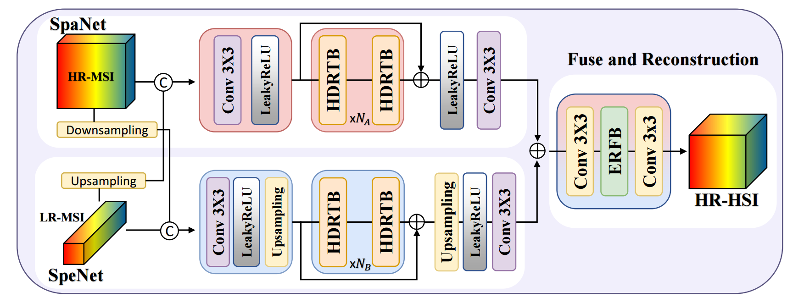
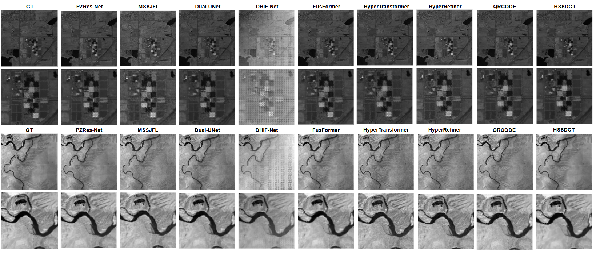

# HSSDCT: Factorized Spatial-Spectral Correlation for Hyperspectral Image Fusion

[](LINK_TO_ARXIV)
[](https://www.python.org/downloads/)
[](https://pytorch.org/)
[](https://opensource.org/licenses/MIT)

<p align="center">
  
</p>

## 🚀 News
- **[2026/01]** 🔥 Our paper has been accepted by **ICASSP 2026**!

## Abstract

This repository contains the official PyTorch implementation of **HSSDCT** (Hierarchical Spatial-Spectral Dense Correlation Network).

**HSSDCT** introduces a novel framework for fusing low-resolution hyperspectral images (LR-HSI) with high-resolution multispectral images (HR-MSI). Unlike recent Transformer-based methods that suffer from quadratic complexity, our method proposes:

- **Hierarchical Dense-Residue Transformer Block (HDRTB)**: Progressively enlarges receptive fields with dense-residue connections for multi-scale feature aggregation.
- **Spatial-Spectral Correlation Layer (SSCL)**: Explicitly factorizes spatial and spectral dependencies, reducing self-attention to **linear complexity** while mitigating spectral redundancy.

Extensive experiments demonstrate that HSSDCT achieves **state-of-the-art performance** with significantly lower computational costs compared to recent methods like FusionMamba and QRCODE.


## Table of Contents

- [Environment Setup](#environment-setup)
- [Data Preparation](#data-preparation)
- [Usage](#usage)
  - [Training](#training)
  - [Testing / Inference](#testing--inference)
- [Project Structure](#project-structure)
- [Configuration Options](#configuration-options)
- [Evaluation Metrics](#evaluation-metrics)
- [Citation](#citation)
- [Acknowledgments](#acknowledgments)

---

## Environment Setup

### Prerequisites

- Python 3.8 or higher
- CUDA 12.x compatible GPU (recommended: NVIDIA GPU with ≥16GB memory)
- Conda (recommended) or pip

### Installation

#### Option 1: Using pip (Recommended)

```bash
# Clone the repository
git clone https://github.com/your-username/HSSDCT.git
cd HSSDCT

# Create a virtual environment (optional but recommended)
python -m venv venv
source venv/bin/activate  # On Windows: venv\Scripts\activate

# Install dependencies
pip install -r requirements.txt
```

#### Option 2: Using Conda

```bash
# Create conda environment
conda create -n hssdct python=3.10
conda activate hssdct

# Install PyTorch with CUDA support
conda install pytorch torchvision pytorch-cuda=12.1 -c pytorch -c nvidia

# Install remaining dependencies
pip install -r requirements.txt
```


## Data Preparation

### Dataset Structure

The dataset should be organized in the following structure under your data root directory:

```
<data_root>/
├── train/
│   ├── <scene_name>/
│   │   ├── GT.npz.npy          # Ground truth HRHSI (256×256×172), float32
│   │   ├── hrmsi.npz           # High-resolution MSI, contains keys: 'hrmsi4', 'hrmsi6'
│   │   └── lrhsi.npz           # Low-resolution HSI, contains keys: 'lrhsi', 'lrhsi1', 'lrhsi2', 'lrhsi3'
│   ├── Hama9_15/
│   ├── TBD4_39/
│   └── ...
├── val/
│   ├── <scene_name>/
│   │   ├── GT.npz.npy
│   │   ├── hrmsi.npz
│   │   └── lrhsi.npz
│   └── ...
└── test/
    ├── <scene_name>/
    │   ├── GT.npz.npy
    │   ├── hrmsi.npz
    │   └── lrhsi.npz
    └── ...
```

### Data File Specifications

| File | Format | Shape | Description |
|------|--------|-------|-------------|
| `GT.npz.npy` | NumPy array | (256, 256, 172) | Ground truth high-resolution hyperspectral image |
| `hrmsi.npz` | NumPy compressed | (256, 256, 4/6) | High-resolution multispectral image (4 or 6 bands) |
| `lrhsi.npz` | NumPy compressed | (64, 64, 172) | Low-resolution hyperspectral image (4× downsampled) |

---

## Usage

### Training

To train the model from scratch:

```bash
python train.py \
    --root /path/to/your/data \
    --train_file ./data_path/train.txt \
    --val_file ./data_path/val.txt \
    --prefix EXPERIMENT_NAME \
    --batch_size 6 \
    --epochs 1000 \
    --lr 0.000055 \
    --lr_scheduler cosine \
    --msi_bands 4 \
    --bands 172 \
    --crop_size 128 \
    --image_size 256 \
    --network_mode 1 \
    --device cuda:0
```

#### Key Training Arguments

| Argument | Default | Description |
|----------|---------|-------------|
| `--root` | `/ssd4t/Fusion_data` | Root directory of the dataset |
| `--prefix` | `ASTUDY_num2_BAND4_SWINY_SNR0` | Experiment name for checkpoints and logs |
| `--batch_size` | 6 | Training batch size |
| `--epochs` | 1000 | Total training epochs |
| `--lr` | 5.5e-5 | Initial learning rate |
| `--lr_scheduler` | `cosine` | Learning rate scheduler (`cosine` or `step`) |
| `--network_mode` | 1 | Network mode: 0=Single, 1=LRHSI+HRMSI, 2=Triplet |
| `--msi_bands` | 4 | Number of HRMSI spectral bands (4 or 6) |
| `--bands` | 172 | Number of hyperspectral bands |
| `--crop_size` | 128 | Training patch size |
| `--snr` | 0 | Signal-to-noise ratio for AWGN (0=no noise) |
| `--nf` | 96 | Base number of feature channels |
| `--gc` | 32 | Growth channels in dense blocks |
| `--joint_loss` | 1 | Enable joint loss (L1 + SAM + BandWiseMSE) |

#### Resume Training

```bash
python train.py \
    --resume_ind 100 \
    --resume_ckpt ./checkpoint/EXPERIMENT_NAME/best.pth \
    [other arguments...]
```

## Project Structure

```
HSSDCT/
├── train.py              # Main training script (training loop & validation)
├── dataset.py            # Dataset classes for data loading
│                         # - Pairwise (LRHSI + HRMSI) & Triplet loading
├── trainOps.py           # Training utilities & Evaluation metrics
│                         # - Losses: SAM Loss, BandWise MSE
│                         # - Metrics: PSNR, ERGAS, RMSE
├── utils.py              # General utilities (Activation, padding)
├── requirements.txt      # Python dependencies
├── models/
│   ├── __init__.py
│   ├── hssdct.py         # Main model architecture
│   │                     # - HSSDCT Framework
│   │                     # - HDRTB (Hierarchical Dense-Residue Transformer Block)
│   │                     # - SSCL (Spatial-Spectral Correlation Layer)
│   └── module_util.py    # Weight initialization utilities
└── data_path/
    ├── train.txt         # Training sample list
    ├── val.txt           # Validation sample list
    └── test.txt          # Test sample list
```

---

## Configuration Options

### Network Architecture Parameters

| Parameter | Default | Description |
|-----------|---------|-------------|
| `--nf` | 96 | Base feature channels |
| `--gc` | 32 | Growth channels in dense blocks |
| `--num_blocks` | 6 | Number of repeated backbone blocks |
| `--groups` | 1 | Group convolution factor (1=full, 4=light) |
| `--out_nc` | 172 | Output channels (should match `--bands`) |


## Evaluation Metrics

The model is evaluated using the following metrics:

| Metric | Description | Optimal |
|--------|-------------|---------|
| **SAM** | Spectral Angle Mapper (degrees) | Lower is better |
| **PSNR** | Peak Signal-to-Noise Ratio (dB) | Higher is better |
| **RMSE** | Root Mean Square Error | Lower is better |
| **ERGAS** | Erreur Relative Globale Adimensionnelle de Synthèse | Lower is better |

---

## Results

Quantitative comparison on the AVIRIS dataset (see Table 1 in the paper):

| Method | Params (M) | FLOPs (G) | PSNR (dB) | SAM |
| :--- | :---: | :---: | :---: | :---: |
| FusionMamba | 21.68 | 134.47 | 30.741 | 1.978 |
| QRCODE | 41.88 | 2231.19 | 35.361 | 1.623 |
| **HSSDCT (Ours)** | **6.78** | **283.84** | **37.212** | **1.348** |

<p align="center">
  
  <br>
  <em>Visual comparison of fused results (Figure 5 from the paper).</em>
</p>

---

## Citation

If you find this work useful in your research, please consider citing:

```bibtex
@inproceedings{lee2026hssdct,
  title     = {HSSDCT: Factorized Spatial-Spectral Correlation for Hyperspectral Image Fusion},
  author    = {Lee, Chia-Ming and Ho, Yu-Hao and Lin, Yu-Fan and Lee, Jen-Wei and Kang, Li-Wei and Hsu, Chih-Chung},
  booktitle = {IEEE International Conference on Acoustics, Speech and Signal Processing (ICASSP)},
  year      = {2026}
}
```

---


## License

This project is licensed under the MIT License - see the [LICENSE](LICENSE) file for details.

---

## Contact

For questions or issues, please open a GitHub issue or contact [jemmy112322@gmail.com].
